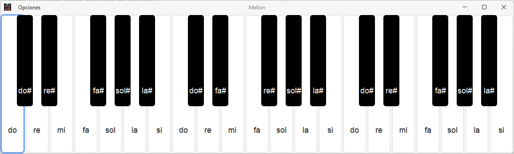
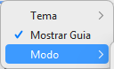
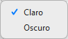
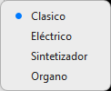

# 🎵 PianoMusial 🎶  
**Simulador de piano digital en Java (Swing + MIDI + Maven)**  

> Un proyecto interactivo que combina sonido MIDI, diseño visual moderno y detección de teclas físicas.  
> Desarrollado con **Java Swing**, **Java Sound API** y **MindFusion Virtual Keyboard**.  

---

## 🌟 Características Principales

- 🎹 **Simulación real de piano** usando el sistema MIDI de Java.  
- 🎧 **Diferentes modos de sonido** (piano clásico, eléctrico, etc.).   
- 🎨 **Interfaz gráfica moderna** con temas (oscuro / claro).  
- ⚙️ **Arquitectura modular**: separación de lógica, vista y control.  

---

## 🖼️ Vista Previa

| Interfaz principal |
|--------------------|
|  |

| Menú de Opciones   |
|--------------------|
|  |

| Temas              |
|--------------------|
|  |

| Modos de Piano     |
|--------------------|
|  |

---

## 🧱 Estructura del Proyecto

```
PianoMusial/
├── src/
│   └── main/
│       ├── java/
│       │   └── com/piano/
│       │       ├── PianoMusial.java      # Clase principal (entry point)
│       │       ├── MusicaMDI.java        # Controlador de sonido MIDI
│       │       └── view/index.java       # Interfaz gráfica (ventana principal)
│       └── resources/
│           └── images/                   # Íconos e imágenes del piano
├── pom.xml                               # Configuración Maven
├── nbactions.xml                         # Configuración de NetBeans
└── README.md
```

---

## ⚙️ Dependencias Maven

```xml
<dependencies>
    <!-- API MIDI de Java (incluida por defecto en JDK) -->
    
    <!-- (Opcional) Look & Feel moderno -->
    <dependency>
        <groupId>com.formdev</groupId>
        <artifactId>flatlaf</artifactId>
        <version>3.4</version>
    </dependency>
</dependencies>
```

> 💡 *Puedes agregar otras librerías visuales según prefieras, por ejemplo FlatLaf para temas claros y oscuros.*

---

## 🚀 Ejecución del Proyecto

1. Clona el repositorio:
   ```bash
   git clone https://github.com/tuusuario/PianoMusial.git
   ```
2. Abre el proyecto en **NetBeans** o tu IDE favorito.  
3. Asegúrate de tener **Java 17+** y **Maven** instalados.  
4. Compila y ejecuta:
   ```bash
   mvn clean install
   java -jar target/PianoMusial-1.0-Version.jar
   ```

---

## 🎹 Cómo Usar el Piano

1. Al iniciar, selecciona un **modo de sonido** desde el menú superior.   
2. Cambia el tema visual (oscuro o claro) desde el menú `Vista`.  
3. Disfruta experimentando con sonidos MIDI de distintos estilos.  

---

## 🧠 Explicación Técnica

### 🎶 Clase `MusicaMDI`
Encargada de reproducir sonidos MIDI:
```java
Synthesizer sys = MidiSystem.getSynthesizer();
sys.open();

MidiChannel[] canal = sys.getChannels();
MidiChannel piano = canal[0];
piano.noteOn(nota, 1000);
Thread.sleep(100);
piano.noteOff(nota);

sys.close();
```

### 🪄 Clase `index.java`
Gestiona la **interfaz gráfica**:
- Asocia botones (`JButton`) con notas (`MusicaMDI.sonidoEfecto(n)`)  
- Controla menús de tema y modo  

---

---

## 🧩 Futuras Mejoras

- 🎵 Implementar grabación y reproducción de melodías.  
- 💾 Guardar configuraciones de usuario (tema, volumen, modo).  
- 🎼 Agregar visualizador de notas (frecuencia y tono).   

---

## 📸 Créditos

- 👨‍💻 **Autor:** [Smit BZ](https://github.com/tuusuario)  
- 🛠️ **Hecho con:** Java, Maven, Swing, Java Sound API  
- 🎨 **Inspiración:** El amor por la música digital y el aprendizaje interactivo  

---

## ❤️ Contribuye

¿Tienes ideas o mejoras?  
Haz un **fork**, crea una **rama**, y envía un **pull request**.  
¡Toda colaboración es bienvenida! 🙌  

```bash
git checkout -b feature/nueva-funcionalidad
git commit -m "Agrega nueva funcionalidad de nota visual"
git push origin feature/nueva-funcionalidad
```

---

## 🎶 “La música no tiene límites, solo teclas por descubrir.”  
> _Proyecto PianoMusial – by Smit BZ_
